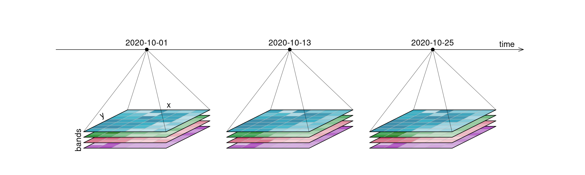

# EOCubeMLAPI: Generic ML and DL APIs for Earth Observation Data Cubes (Work in Progress)

## Introduction
This repository hosts the Proof of Concept (PoC) leading to Generic Machine Learning (ML) and Deep Learning (DL) APIs designed specifically for processing Earth Observation (EO) Data Cubes/Satellite Image Time Series. Our primary goal is to advance interoperability and reproducibility in the analysis of EO data cubes, particularly in cloud-based environments. This project aims to provide a standardized, easy-to-use interface for applying advanced ML and DL techniques to EO data, facilitating research and applications in fields such as biodiversity monitoring, land use analysis, and crop yield monitoring.

## Target Features
- **Unified API Structure**: A consistent and intuitive API design that allows users to apply various ML and DL models to EO data cubes without needing extensive knowledge about the underlying data structures.
- **Cloud Optimization**: Designed for efficient performance in cloud computing environments, enabling scalable analysis of large EO datasets.
- **Interoperability**: Seamless integration with existing EO data cube standards and cloud services, ensuring compatibility with a wide range of data sources and processing tools.
- **Reproducibility**: Emphasis on reproducible research practices, with comprehensive documentation and version control of both data and analysis pipelines.
- **Modular Design**: Flexibility to add new ML and DL models, as well as compatibility with existing ML libraries and frameworks.
- **Community-Driven**: Open-source development, encouraging contributions and feedback from the EO ML/DL communities.

## Getting Started
### Prerequisites
Before you begin, ensure you have met the following requirements:
- Python 3.8 or later
- Familiarity with basic concepts of ML/DL and EO data

### Installation
TO DO

### Documentation
Developer Guide: Instructions for contributing to the project.
Contributing
Contributions are welcome! Please read our [Contributing Guidelines](CONTRIBUTING.md)for details on the process for submitting pull requests to us.

## License
This project is licensed under the Apache License Version 2.0 - see the [LICENSE](LICENSE) file for details.

## Acknowledgments
Organizations and projects that provided data and tools.
Contributors and community members who participated in discussions and development.
Contact
For questions and feedback, please contact the project maintainer at [brian.pondi@uni-muenster.de](mailto:brian.pondi@uni-muenster.de).

## Project Status
This project is currently in the exploration stage and under active development.